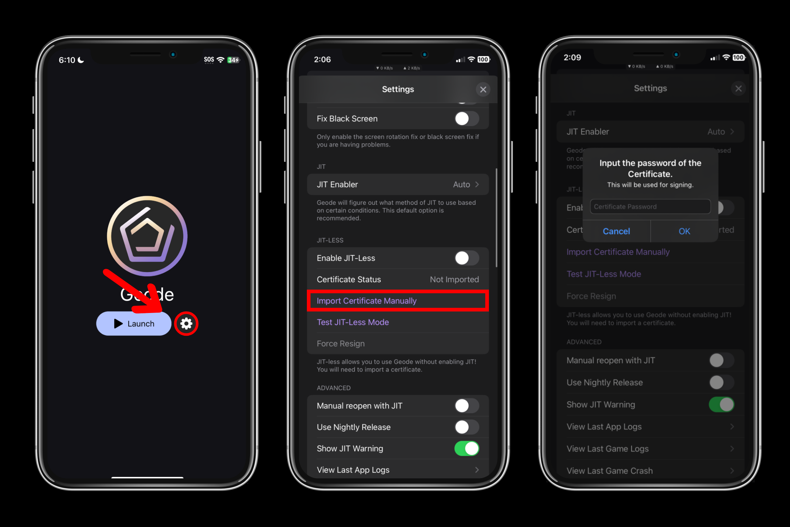

# Installing Geode (Apple Developer Certificate)
This guide will teach you how to install Geode using an Apple Developer Certificate, and how to launch Geode depending on which method you choose (JIT, JIT-Less).

| Supported on | Requires Computer? | Mod Support | Price |
|--------------|--------------------|-------------------|-------|
| iOS 14 and above | No* | *Partial* to *Full* (*Partial* on JIT-Less) | Paid |

# Prerequisites
> [!NOTE]
> JIT method will require the use of a computer to set up the JIT enabler. JIT-less method will not require a computer and can be done on device.

## With JIT
- An Apple developer certificate
- A computer running Windows, macOS or Linux
- [LocalDevVPN](https://apps.apple.com/us/app/localdevvpn/id6755608044) from the App Store
- [iloader](https://github.com/nab138/iloader/releases) for the pairing file
- USB Cable to connect your device (Lightning / USB C)
- Full version of Geometry Dash installed
- An internet connection
- A passcode on your device (required for pairing file)
- IPA file of Geode launcher from [Releases](https://github.com/geode-sdk/ios-launcher/releases/latest)

## With JIT-Less
- Full version of Geometry Dash installed
- An internet connection
- An Apple developer certificate
- IPA file of Geode launcher from [Releases](https://github.com/geode-sdk/ios-launcher/releases/latest)

# Install Geode
## JIT Method
1. Download the StikDebug IPA file from [Releases](https://github.com/StephenDev0/StikDebug/releases).
2. Install StikDebug using the installer of your choice (ESign, Feather, KSign, etc.). **Make sure to install StikDebug with the Developer certificate, not the Distribution certificate.**
3. Install Geode using the installer of your choice (ESign, Feather, KSign, etc.). **Make sure to install Geode with the Developer certificate, not the Distribution certificate.**.
4. Connect your device back to your computer via cable and then open iloader. In iloader, find **Manage Pairing File**. Click on it and click **Place** near StikDebug. This will place the pairing file to StikDebug, which is essential for StikDebug to function.
5. Connect to LocalDevVPN.
6. Now you should be set! Simply tap on **Connect by App** in StikDebug to enable JIT on Geode.

> [!WARNING]
> Since LocalDevVPN only works on Wi-Fi and airplane mode, This also means StikDebug also only works on Wi-Fi and airplane mode. To use StikDebug on cellular, do these steps:

1. Enable cellular.
2. Connect to LocalDevVPN.
3. Switch to airplane mode.
4. Launch Geode with JIT using StikDebug.
5. Turn off airplane mode.

You will have to do this every time you want to launch Geode with JIT on cellular. As long as Geode stays open, you will not need to do these steps.

## JIT-Less Method
1. Install Geode using the installer of your choice (ESign, Feather, KSign, etc.). **Make sure to install Geode with the Developer certificate, not the Distribution certificate**.
2. Press **"Enable JIT-Less"**.
3. Press **"Import Certificate Manually"**.
4. Choose the **.p12** file of the certificate you used to sign the Geode launcher.
5. Input the password of your certificate **(make sure to input the password correctly, or Geode will fail to do the signing process)**.
6. Press **"Test JIT-Less Mode"** to test if JIT-less mode works properly.

# Conclusion
You should now be able to run Geometry Dash with Geode! You can install mods by tapping the Geode button on the bottom of the menu, and browse for mods to install!
