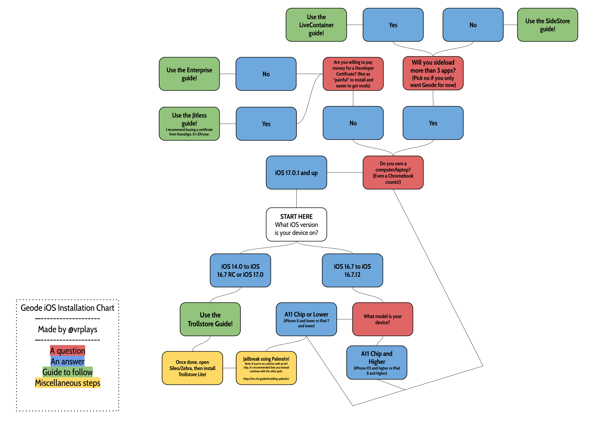

# Getting Started on Installing Geode
This page **will help you install Geode on your iDevice**. Unlike other platforms, installing Geode on iOS is not straightforward due to how locked down the operating system is, so this guide exists for you to find the best methods to install Geode on your iDevice.
> [!WARNING]
> Geode **only works from iOS 14 to the latest iOS version**. Geode will not work on iOS versions below iOS 14.

> [!TIP]
> If you **don't know the iOS version of your iDevice**, follow [this page from Apple](https://support.apple.com/en-us/109065) to check your iOS version.

To get started, choose an installation guide for your iOS version from the table:

| Method | Supported iOS | Computer Required | Mod Compatibility | Price |
| ------ | ------------- | ----------------- | ----------------- | ----- |
| [TrollStore (and optionally Jailbreak)](/OLD-IOS-INSTALL.md) | iOS 14–17.0 (except 16.7.x & 17.0.x) | No* | High (Native) | Free |
| [SideStore](/MODERN-IOS-INSTALL.md) | iOS 14+ | First-time setup only | High (JIT) / Medium (JIT-less) | Free |
| [Apple Developer Certificate](/APPLE-DEV-CERT-INSTALL-GUIDE.md) | iOS 14+ | No* | High (with JIT), Medium (with JIT-less) | Paid |
| [Free Certificates](/ENTERPRISE-INSTALL-GUIDE.md) | iOS 14+ | No | Medium | Free |
| [LiveContainer](/LIVECONTAINER-INSTALL-GUIDE.md) | iOS 15+ | Yes* | High (with JIT), Medium (with JIT-less) | Free |

> [!NOTE]
> Apple Developer Certificate method only requires a computer if you want to enable JIT. LiveContainer indirectly requires a computer as LiveContainer itself has to be sideloaded through SideStore

In case you do not know which installation method to use, look at the image below (starting on the white box) to see which guide you should use. (ending on the green box)

