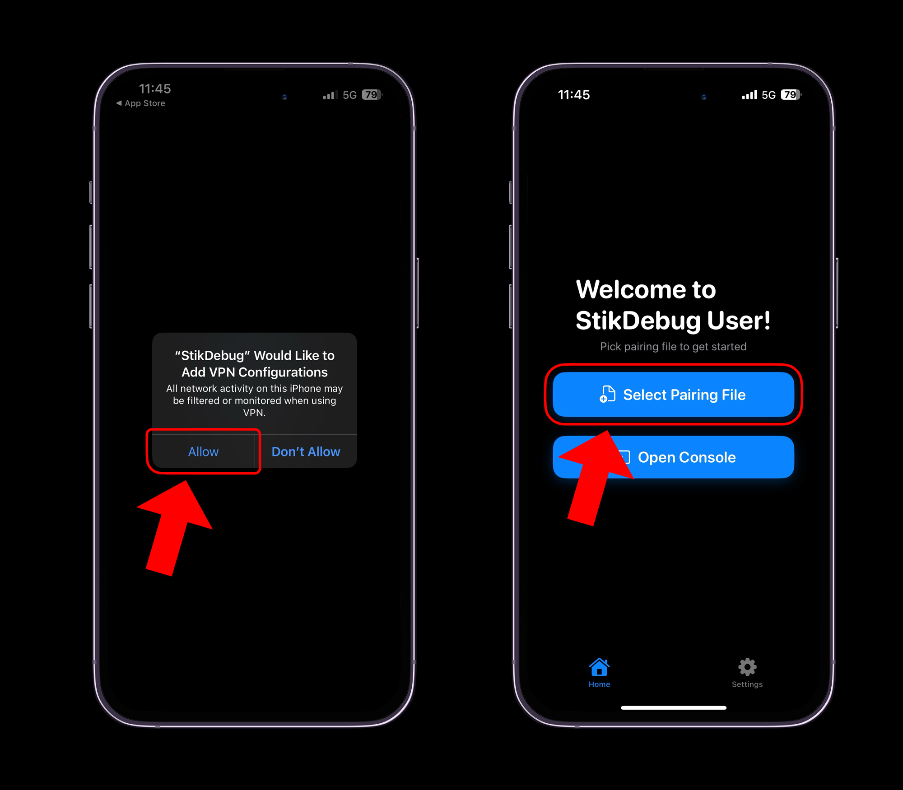

# Installation Guide
> [!WARNING]
> For this installation guide, it is **required** to have a computer with Administrator access, as this guide will require installing software on your computer to sideload Geode, and to obtain a pairing file for **JIT**. Additionally, **JIT** is a **__requirement__** if you want to run Geode without jailbreaking.

> [!WARNING]
> Do **not** use enterprise certificates in sideloaders **like ESign and Scarlet.** Those certificates **do not have the entitlements for enabling JIT** (`get-task-allow`). You **won't be able to enable JIT** if you use them. If you want to use ESign, buy a developer certificate.

## Prerequisites
- iOS/iPadOS 14.0 or later
- PC (Windows, Linux) or Mac OS
- Apple ID (Secondary / Throwaway Recommended)
- USB Cable to connect your device (Lightning / USB C)
- An internet connection
- Full version of Geometry Dash from the [App Store](https://apps.apple.com/us/app/geometry-dash/id625334537)
- IPA / TIPA file of Geode launcher from [Releases](https://github.com/geode-sdk/ios-launcher/releases) (only get the TIPA file if you want to use the jailbreak tweak)

## Installing SideStore
> [!TIP]
> After installing **SideStore**, a PC is **not required** after the initial install.
> You can skip this step if you are using Sideloadly or TrollStore, but you may still need to follow the first step, especially if you have never sideloaded an app before.

1. **Enabling Developer Mode (iOS 16+)**
	- If you are on iOS 16 or later, you will need to enable **Developer Mode** in order to launch third party apps like SideStore, otherwise you will encounter this error when attempting to sideload SideStore or any app:
	- 
	- To enable **Developer Mode** on your iOS device, navigate to `Settings -> Privacy & Security -> Developer Mode`. Do note that this will require restarting your device.
	- 
	- After your device restarts, you will be prompted to "Turn on Developer Mode", press "Turn On", and **Developer Mode** should be enabled!

2. **Installing SideStore** (Recommended)
	- Follow the steps provided here: https://sidestore.io/#get-started
	- SideStore is recommended if you do not want to refresh your apps while keeping your PC on.

Now you can proceed with installing Geode! If you are not jailbroken, **install the IPA**. If you're jailbroken and plan to stay so, **install the TIPA** version.

## Installing Geode through SideStore
> [!NOTE]
> You will need to **refresh** both the store and Geode every week, otherwise you will not be able to run the app.

Navigate to the **My Apps** tab, and tap the `+` button to add an app. Select the IPA for the Geode app, and the Geode app should appear on your home screen!

## Installing TrollStore
> [!TIP]
> TrollStore can permanently sign and install any application, eliminating the need to refresh the launcher — though this comes at the cost of some compatibility. Once TrollStore is successfully installed, you'll never need a computer again.

> [!WARNING]
> Make sure your device is compatible! If your device is on iOS 14.0 *beta* 1 or earlier, is running iOS 16.7.x (excluding 16.7 RC (20H18)), or is running iOS 17.0.1 or newer, it will ***never*** be supported by TrollStore.

<h1 align="center">TrollStore Compatibility and Installers</h1>

<table>
  <colgroup>
    <col span="1" style="width: 13%;">
    <col span="1" style="width: 13%;">
    <col span="1" style="width: 23%;">
    <col span="1" style="width: 23%;">
    <col span="1" style="width: 28%;">
  </colgroup>
  <thead>
    <tr>
      <th style="text-align: center; font-weight: bold;">From</th>
      <th style="text-align: center; font-weight: bold;">To</th>
      <th style="text-align: center; font-weight: bold;">arm64 (A8)</th>
      <th style="text-align: center; font-weight: bold;">arm64 (A9-A11)</th>
      <th style="text-align: center; font-weight: bold;">arm64e (A12-A17/M1-M2)</th>
    </tr>
  </thead>
  <tbody>
    <tr>
      <td style="text-align: center; font-weight: bold;" colspan="2">14.0 beta 1 and earlier</td>
      <td style="text-align: center;" colspan="3">Unsupported</td>
    </tr>
    <tr>
      <td style="text-align: center; font-weight: bold;">14.0 beta 2</td>
      <td style="text-align: center; font-weight: bold;">14.8.1</td>
      <td style="text-align: center;" colspan="2"><a href="https://ios.cfw.guide/installing-trollstore-trollinstallerx">TrollInstallerX</a></td>
      <td style="text-align: center;"><a href="https://ios.cfw.guide/installing-trollstore-trollhelperota">TrollHelperOTA</a></td>
    </tr>
    <tr>
      <td style="text-align: center; font-weight: bold;">15.0</td>
      <td style="text-align: center; font-weight: bold;">15.5 beta 4</td>
      <td style="text-align: center;" colspan="3"><a href="https://ios.cfw.guide/installing-trollstore-trollhelperota">TrollHelperOTA</a></td>
    </tr>
    <tr>
      <td style="text-align: center; font-weight: bold;">15.5</td>
      <td style="text-align: center; font-weight: bold;">15.5</td>
      <td style="text-align: center;"><a href="https://ios.cfw.guide/installing-trollstore-trollinstallermdc">TrollInstallerMDC</a></td>
      <td style="text-align: center;"><a href="https://ios.cfw.guide/installing-trollstore-trollinstallerx">TrollInstallerX</a></td>
      <td style="text-align: center;"><a href="https://ios.cfw.guide/installing-trollstore-trollhelperota">TrollHelperOTA</a></td>
    </tr>
    <tr>
      <td style="text-align: center; font-weight: bold;">15.6 beta 1</td>
      <td style="text-align: center; font-weight: bold;">15.6 beta 3</td>
      <td style="text-align: center;" colspan="3"><a href="https://ios.cfw.guide/installing-trollstore-trollhelperota">TrollHelperOTA</a></td>
    </tr>
    <tr>
      <td style="text-align: center; font-weight: bold;">15.6 beta 4</td>
      <td style="text-align: center; font-weight: bold;">15.6.1</td>
      <td style="text-align: center;"><a href="https://ios.cfw.guide/installing-trollstore-trollinstallermdc">TrollInstallerMDC</a></td>
      <td style="text-align: center;"><a href="https://ios.cfw.guide/installing-trollstore-trollinstallerx">TrollInstallerX</a></td>
      <td style="text-align: center;"><a href="https://ios.cfw.guide/installing-trollstore-trollhelperota">TrollHelperOTA</a></td>
    </tr>
    <tr>
      <td style="text-align: center; font-weight: bold;">15.7</td>
      <td style="text-align: center; font-weight: bold;">15.7.1</td>
      <td style="text-align: center;"><a href="https://ios.cfw.guide/installing-trollstore-trollinstallermdc">TrollInstallerMDC</a></td>
      <td style="text-align: center;" colspan="2"><a href="https://ios.cfw.guide/installing-trollstore-trollinstallerx">TrollInstallerX</a></td>
    </tr>
    <tr>
      <td style="text-align: center; font-weight: bold;">15.7.2</td>
      <td style="text-align: center; font-weight: bold;">15.8.4</td>
      <td style="text-align: center;"><a href="https://ios.cfw.guide/installing-trollstore-trollmisaka">TrollMisaka</a></td>
      <td style="text-align: center;" colspan="2"><a href="https://ios.cfw.guide/installing-trollstore-trollinstallerx">TrollInstallerX</a></td>
    </tr>
    <tr>
      <td style="text-align: center; font-weight: bold;">16.0 beta 1</td>
      <td style="text-align: center; font-weight: bold;">16.0 beta 3</td>
      <td style="text-align: center;">Not Applicable</td>
      <td style="text-align: center;"><a href="https://ios.cfw.guide/installing-trollstore-trollinstallerx">TrollInstallerX</a></td>
      <td style="text-align: center;"><a href="https://ios.cfw.guide/installing-trollstore-trollhelperota">TrollHelperOTA</a></td>
    </tr>
    <tr>
      <td style="text-align: center; font-weight: bold;">16.0 beta 4</td>
      <td style="text-align: center; font-weight: bold;">16.6.1</td>
      <td style="text-align: center;">Not Applicable</td>
      <td style="text-align: center;" colspan="2"><a href="https://ios.cfw.guide/installing-trollstore-trollinstallerx">TrollInstallerX</a></td>
    </tr>
    <tr>
      <td style="text-align: center; font-weight: bold;">16.7 RC</td>
      <td style="text-align: center; font-weight: bold;">16.7 RC</td>
      <td style="text-align: center;">Not Applicable</td>
      <td style="text-align: center;" colspan="2"><a href="https://ios.cfw.guide/installing-trollstore-trollrestore">TrollRestore</a></td>
    </tr>
    <tr>
      <td style="text-align: center; font-weight: bold;">16.7</td>
      <td style="text-align: center; font-weight: bold;">16.7.11</td>
      <td style="text-align: center;">Not Applicable</td>
      <td style="text-align: center;" colspan="2">Unsupported</td>
    </tr>
    <tr>
      <td style="text-align: center; font-weight: bold;">17.0 beta 1</td>
      <td style="text-align: center; font-weight: bold;">17.0 beta 4</td>
      <td style="text-align: center;">Not Applicable</td>
      <td style="text-align: center;"><a href="https://ios.cfw.guide/installing-trollstore-trollinstallerx">TrollInstallerX</a></td>
      <td style="text-align: center;"><a href="https://ios.cfw.guide/installing-trollstore-trollrestore">TrollRestore</a></td>
    </tr>
    <tr>
      <td style="text-align: center; font-weight: bold;">17.0 beta 5</td>
      <td style="text-align: center; font-weight: bold;">17.0</td>
      <td style="text-align: center;">Not Applicable</td>
      <td style="text-align: center;" colspan="2"><a href="https://ios.cfw.guide/installing-trollstore-trollrestore">TrollRestore</a></td>
    </tr>
    <tr>
      <td style="text-align: center; font-weight: bold;" colspan="2">17.0.1 and later</td>
      <td style="text-align: center;">Not Applicable</td>
      <td style="text-align: center;" colspan="2">Unsupported</td>
    </tr>
  </tbody>
</table>

## Installing Geode through TrollStore

Tap the `+` button and tap either **Install IPA File** or **Install From URL**, depending if you manually downloaded the TIPA file. After either selecting the TIPA file for the Geode app, or providing the URL, the Geode app should appear on your home screen!

## Post Installation (IPA / Non-Jailbroken)
> [!TIP]
> You can skip this step if you installed the .tipa version of Geode, and are jailbroken. Simply follow the steps in the setup process in the app.

After going through the setup process, you may have seen the warning that **Just-In-Time** (JIT) compilation is required. This is true if you want to run Geode without being jailbroken, as by default, Apple restricts how apps can manage memory.

> [!WARNING]
> JIT also requires you to have **Wi-Fi** connection or **Airplane Mode** enabled on your iOS device if you're not jailbroken or don't have Trollstore. Cellular will **not work**.

There are a few ways to launch Geode with JIT, depending on both iOS version, and your use case.

### For iOS 16.7 RC, iOS 17.0 and Below
> Install **TrollStore** using this guide: https://ios.cfw.guide/installing-trollstore

#### TrollStore
1. Enable the **URL Scheme** setting in TrollStore.
2. Go back to Geode and tap the **Launch** button in the Geode app.
3. Geode should launch in Geometry Dash!

### For iOS 17.4+ and Later
#### StikDebug
> [!NOTE]
> For the first time setup, you will need a computer to get a Pairing File. If you installed SideStore, you likely already have a pairing profile, meaning there is no need to reinstall Jitterbug Pair.

#### Steps for downloading Jitterbug Pair (Skippable if you already have a Pairing File)
1. Go to [Jitterbug Pair](https://github.com/osy/Jitterbug/releases) and download the version for your computer.
2. Run the program with your iOS device connected to your computer. It will save a file to your computer.
3. Use iCloud, Airdrop, or a website such as [Pairdrop](https://pairdrop.net/) to upload the pairing file to your iOS device.

#### Downloading StikDebug
1. Download StikDebug from the App Store: https://apps.apple.com/us/app/stikdebug/id6744045754
2. Launch the app
3. It'll ask you to add "StikDebug" as a VPN Configuration. Click "Allow" and enter your passcode to add it.
4. Go back to StikDebug and click on "Select Pairing File". You actually will need **WiFi connection** on your phone for it to download DDI.
5. After DDI is mounted you won't need WiFi. Now you can go back to Geode and click on **Launch**.
6. Geode will now launch in Geometry Dash.

> [!TIP]
> StikDebug works without Wi-Fi connection, just by Airplane Mode. Unfortunately, this on-device VPN does not support cellular. However, you can use cellular data after launching an app with JIT.

## Conclusion
You should now be able to run Geometry Dash with Geode! You can install mods by tapping the **Geode** button on the bottom of the menu, and browse for mods to install!
