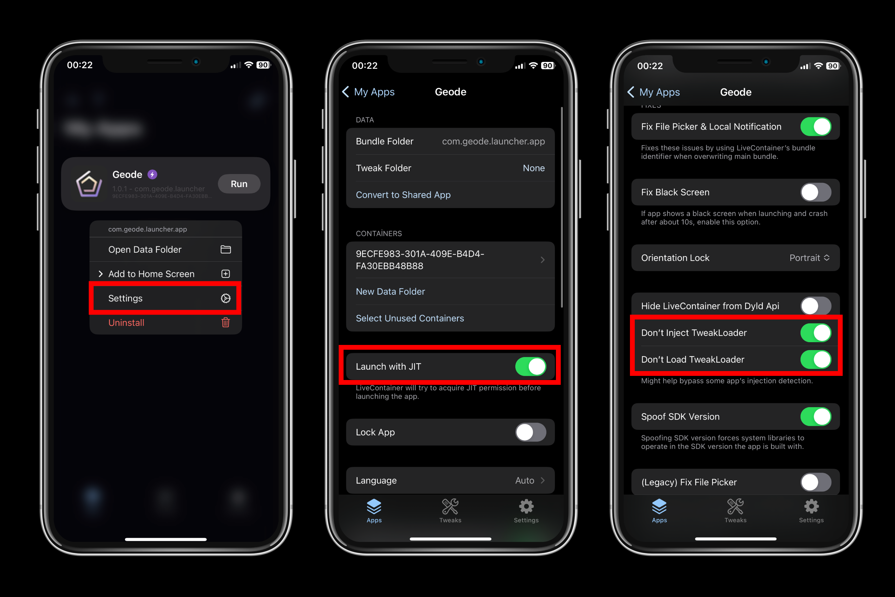

# Installation Guide (LiveContainer)

| Supported on | Requires Computer? | Mod Compatibility | Price |
|--------------|--------------------|-------------------|-------|
| iOS 14.0 and above | Yes | *Medium* to *High* (*Medium* on JIT-Less) | Free |

This tutorial is for people that use LiveContainer to bypass Apple's 3 active app and 10 app ID limit.

> [!NOTE]
> This guide assumes you have installed LiveContainer **through SideStore**. If you didn't, make sure to follow the [SideStore guide](/MODERN-IOS-INSTALL.md), then come back to this guide.

# With JIT
## Prerequisites
- LiveContainer
- A **JIT enabler** (e.g. [StikDebug](https://github.com/StephenDev0/StikDebug/releases), has to be installed through SideStore)
- [LocalDevVPN](https://apps.apple.com/us/app/localdevvpn/id6755608044) if you are going to use StikDebug
- An internet connection
- IPA file of Geode launcher from [Releases](https://github.com/geode-sdk/ios-launcher/releases/latest)

## Set Up LiveContainer for Geode
1. Install Geode using LiveContainer.
2. Hold on the app and go to the Geode app settings in LiveContainer, then **enable these settings:**

- **Launch with JIT**
- **Don't Inject TweakLoader**
- **Don't Load TweakLoader**

After these steps:

3. Open Geode
4. Press **"Verify Geometry Dash"**
5. Press **"Download"**
6. Press **"Launch"**

# With JIT-Less
## Prerequisites
- LiveContainer (Latest)
- Confirming JIT-less works on LiveContainer
- An internet connection
- IPA file of Geode launcher from [Releases](https://github.com/geode-sdk/ios-launcher/releases/latest)

## Set Up LiveContainer for Geode
- Install Geode using LiveContainer.
- Hold on the app and go to the Geode app settings in LiveContainer, then **enable these settings:**

- **Fix File Picker**
- **Fix Local Notification**
- **Use LiveContainer's Bundle ID** (If on new version of LiveContainer)
- **Don't Inject TweakLoader**
- **Don't Load TweakLoader**

After these steps:
1. Tap on **"Settings"** on the bottom right.
2. Tap **"Import Certificate from SideStore"**.
3. On the popup in **SideStore**, hit **"Export"**.
4. Get back to LiveContainer and scroll down until you see the version of LiveContainer.
5. Tap on the version text 5 times.
6. Scroll down and tap **"Export Cert"** then return to **"Apps"** in the bottom left.

Finally, the last steps are:

7. Open Geode.
8. Press **"Verify Geometry Dash"**.
9. Press **"Download"**.
10. Open Settings.
11. Make sure **Enable JIT-Less** is on.
12. Press **"Test JIT-Less Mode"** to test if JIT-less mode works properly.
13. Exit settings & press **"Launch"**.