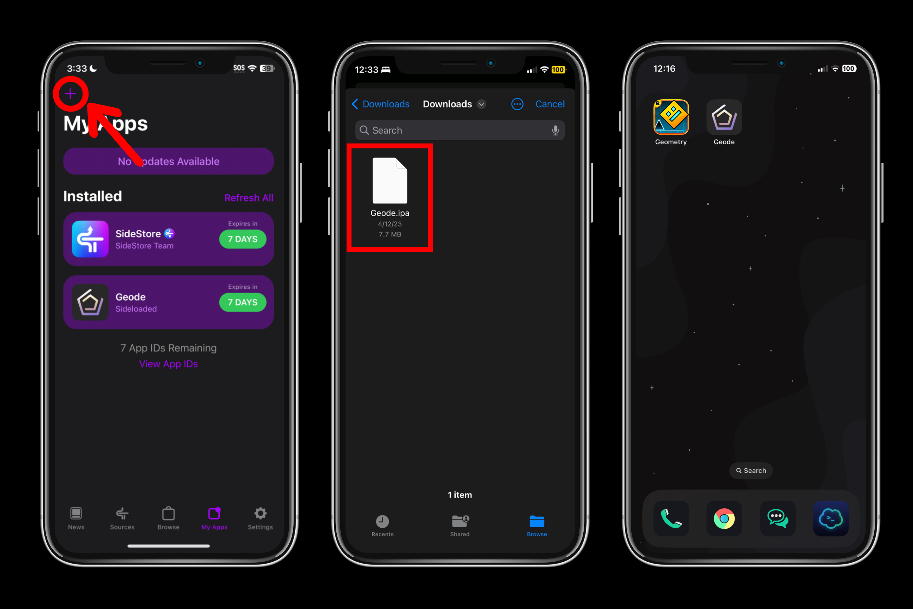
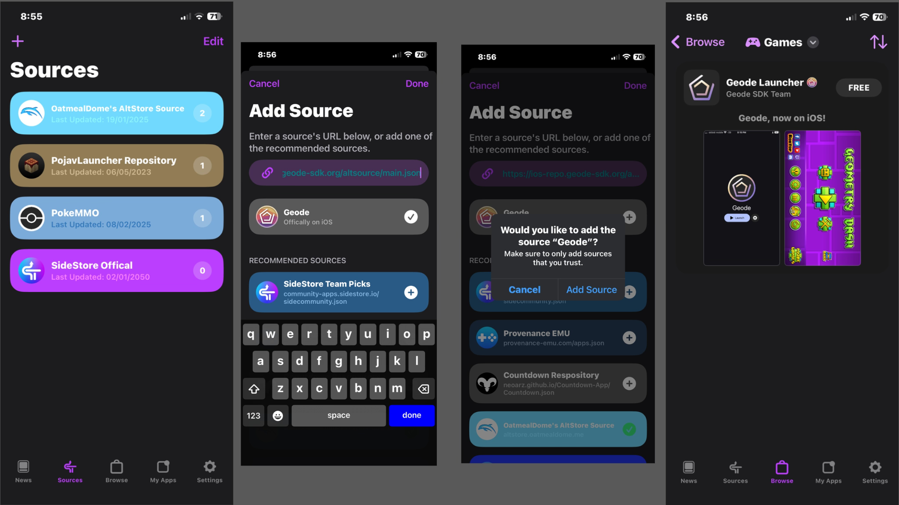
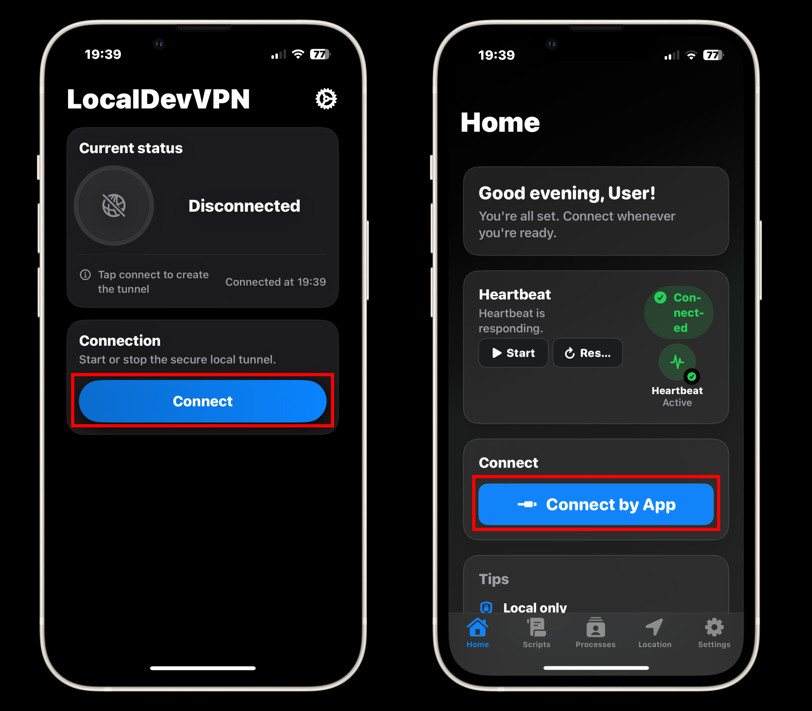

# Installation Guide (SideStore)

> [!WARNING]
> For this installation guide, it is **required** to have a computer with Administrator access, as this guide will require installing software on your computer to sideload Geode, and to obtain a pairing file for **JIT**. Additionally, **JIT** is a **__requirement__** to run Geode.
> \
> This guide assumes you will be installing SideStore. Using enterprise certificates to install SideStore **will not work**, as the usage of a PC is required to sideload SideStore.

| Supported on | Requires Computer? | Mod Compatibility | Price |
|--------------|--------------------|-------------------|-------|
| iOS 16 to 17.4 and above | Yes | *Medium* to *High* (*Medium* on JIT-Less) | Free |

## Prerequisites
- A computer running Windows, macOS or Linux
- [LocalDevVPN](https://apps.apple.com/us/app/localdevvpn/id6755608044) from the App Store
- [iloader](https://github.com/nab138/iloader/releases) to install SideStore
- An Apple ID (A secondary Apple ID is recommended, though it's not necessarily required)
- USB Cable to connect your device (Lightning / USB C)
- Full version of Geometry Dash installed
- An internet connection
- A passcode on your device (required for pairing file)
- IPA file of Geode launcher from [Releases](https://github.com/geode-sdk/ios-launcher/releases/latest) (If you don't want to use this, follow the **AltSource** method below)

## Install SideStore
1. Connect your phone to your computer via cable and trust the computer on your phone when prompted (trusting the computer is an important step!)
2. Download iloader on your computer and LocalDevVPN on your iDevice as mentioned in the **Prerequisites** section
3. Sign in with your Apple ID in iloader
4. In the **Installers** section in iloader, you should generally click "SideStore (Stable)".
5. You will most likely get an **Untrusted Developer** error. To fix this, go to Settings > General > VPN and Device Management > Your Apple ID and press Trust. After doing this, move to the **Enabling Developer Mode** section below.

> [!NOTE]
> The Developer Mode option will not show up if you do not install SideStore! It will only appear when you install SideStore. So make sure to follow the **Install SideStore** section first, then try to enable Developer Mode.

### Enabling Developer Mode
- You will need to enable **Developer Mode** in order to launch third party apps like SideStore **after you install them**, otherwise you will encounter this error when attempting to launch SideStore or any sideloaded app:
- 
- To enable **Developer Mode** on your iOS device, navigate to `Settings -> Privacy & Security -> Developer Mode`. Do note that this will require restarting your device.
- 
- After your device restarts, you will be prompted to "Turn on Developer Mode", press "Turn On", and **Developer Mode** should be enabled!

### Installing Geode through SideStore
> [!NOTE]
> You will need to **refresh** both the store and Geode every week, otherwise you will not be able to run the app.

Here you have 2 options:

1: Navigate to the **My Apps** tab, and tap the `+` button to add an app. Select the IPA for the Geode app, and the Geode app should appear on your home screen!

2: Navigate to the **Sources** tab, and tap the `+` button to add the Geode AltSource. In the input box, type `https://ios-repo.geode-sdk.org/altsource/main.json`, then press the `+` button. Now go to the **Browse** tab, then **Games**, and you will find Geode. Press `Free` to install it.

> [!NOTE]
> The AltSource method may recieve updates *later*, and should only be used if you are okay with this.

# Launch Geode
## With JIT
> [!TIP]
> Skip this **if you're on iOS 16**. SideStore lets you enable JIT **directly from it**. To do so, go to the **My Apps** section in SideStore, hold Geode, and press **"Enable JIT"** (you need to have LocalDevVPN enabled for this).

> [!NOTE]
> For the first time setup, you will need a computer to get a pairing file. If you installed SideStore, you likely already have a pairing file, meaning there is no need to reinstall iDevice Pair.

#### Installing StikDebug
1. Get the latest StikDebug IPA file from [Releases](https://github.com/StephenDev0/StikDebug/releases).
2. Install StikDebug from SideStore.
3. Connect your phone back to your computer via cable and then open iloader. In iloader, find **Manage Pairing File**. Click on it and click **Place** near StikDebug. This will place the pairing file to StikDebug, which is essential for StikDebug to function.
4. Connect to LocalDevVPN.
5. Launch StikDebug.
6. Now you should be set! Simply tap on **Connect by App** to enable JIT on Geode.

> [!WARNING]
> Since LocalDevVPN only works on Wi-Fi and airplane mode, This also means StikDebug also only works on Wi-Fi and airplane mode. To use StikDebug on cellular, do these steps:

1. Enable cellular.
2. Connect to LocalDevVPN.
3. Switch to airplane mode.
4. Launch Geode with JIT using StikDebug.
5. Turn off airplane mode.

You will have to do this every time you want to launch Geode with JIT on cellular. As long as Geode stays open, you will not need to do these steps.

# With JIT-Less
1. Press **"Enable JIT-Less"**.
2. Press **"Import SideStore Certificate"**.
3. Press **"Test JIT-Less Mode"** to test if JIT-less mode works properly.
4. Press **"Launch"**.

## Conclusion
You should now be able to run Geometry Dash with Geode! You can install mods by tapping the **Geode** button on the bottom of the menu, and browse for mods to install!
